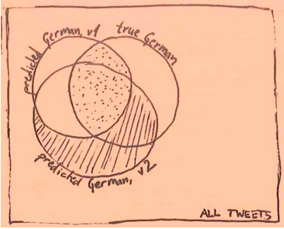
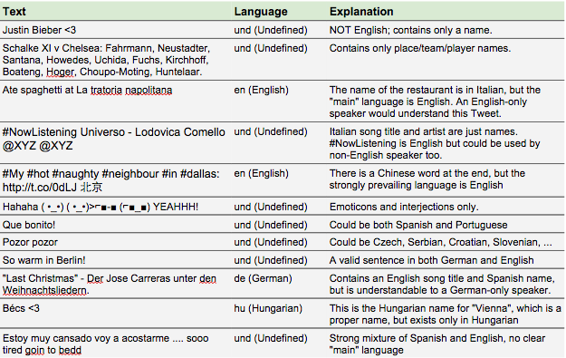

Evaluating language identification performance
==============================================

**Note:** This text also appeared on [Twitter's Engineering Blog](https://blog.twitter.com/2015/evaluating-language-identification-performance).

Understanding the content of Tweets is important for many reasons:
grasping a user’s interests (which in turn lets us show more relevant
content), improving search, and fighting spam. There are many steps
involved in a typical natural language processing pipeline, but one of
the first and most fundamental steps is *language identification* —
determining the language in which a piece of text is written.

This is generally not a hard problem. Even with a small and simple model
(e.g., list of most common words in each language), we can achieve
near-perfect accuracy when classifying news articles [^1], for example.
However, Tweets are different from the average news article or web page:
they’re very short and use informal language. In practice, they’re
different enough that we don’t want to evaluate language classifiers on
news articles, because that doesn’t tell us much about their performance
on Tweets. What we need, then, is a golden set of language-annotated
Tweets to evaluate on. So, how did we go about constructing it?

### Measuring accuracy on all of Twitter

To measure performance on Twitter overall, we can simply take a uniform
sample of all Tweets and manually annotate it.

The problem is that each annotator can recognize only one or two
languages, and it’s prohibitively inefficient and expensive to have
every annotator look at every Tweet. Therefore, we annotated every Tweet
with three independent software packages (see Semi-automatic annotation,
below) and then kept the majority language as “likely.” All Tweets with
likely language X were given to native speakers of X to annotate. The
annotators were instructed to either enter the true language (if they
recognized it) or skip the Tweet. For all skipped Tweets, we then
determined the second most-likely language and gave the Tweet to
annotators again. For the Tweets that got skipped even in the second
round, we manually investigated the user’s profile and used internet
resources (dictionaries, search, etc.) to determine the true language.
For 0.18% of Tweets, we were unable to determine the language; because
it’s a tiny number, we simply discarded them.

In total, we ended up with 120,575 annotated Tweets. This **uniformly
sampled dataset** is available for download (see below).

### Measuring classifier performance for rare languages

The uniformly sampled dataset theoretically allows us to measure overall
accuracy, as well as precision and recall for each language. However, we
can detect over 60 languages, and only 17 of them have at least 100
Tweets in this dataset. The fewer Tweets we have in a certain language,
the less we can say about that language’s performance. For example,
based on just five Czech Tweets, it is impossible to say with any
reasonable confidence what the actual precision and recall are of our
Czech classifier. We therefore built two more datasets.

#### Recall

We construct a dataset for each language separately. Let’s take German
as an example; we follow the same procedure for all languages.

To measure recall of the German classifier, we need an unbiased [^2]
sample of all Tweets in German. We cannot simply task a human annotator
to go through all Tweets, as they would need to read hundreds of
thousands of English Tweets to gather 1000 German ones [^3]. Instead, we
use the following heuristic procedure:

-   Determine the set of users U who Tweeted in German (according to our
    classifier) at least 10% of the time between March and May 2014
-   Randomly sample 2000 Tweets created by users from U in July 2014
-   Use human annotators to discard all non-German Tweets from the set
    of 2000

We call this the **recall-oriented dataset**. The data collection
strategy is obviously not uniform; how certain can we be that it
provides an accurate estimate of recall? For the 10 biggest languages,
we measured our classifier’s recall on three datasets:

1.  the uniformly sampled dataset
2.  dataset of geo-tagged Tweets from Germany
3.  the recall-oriented dataset as described above.

The differences in recall estimates were statistically indistinguishable
using a 95% confidence interval [^4]. For smaller languages, we don’t
always have enough data to rely on geo tags or the uniform stream, which
is why we used the “10% heuristic” outlined above for all languages.
While our 3-way comparison test on the 10 big languages does not
strictly guarantee that the recall-oriented dataset is a good recall
estimator for small languages as well, it did assuage our concerns
significantly.

To get even better recall estimates for the large languages, we suggest
using the union of the uniformly sampled dataset and the recall-oriented
dataset.

#### Precision

Measuring precision (on the full-Twitter language distribution) is
trivial. Grab, say, one thousand random Tweets for which your classifier
(let’s call it v1) triggers, and have them human-annotated with two
labels: German or non-German. We call this the **precision-oriented
dataset**, and we can use it on its own or union it with the uniformly
sampled dataset (to get even better estimates for the large languages).

A major caveat is that if we later want to evaluate a different
algorithm (let’s call it v2; it could be an improved variant of v1, or a
completely different algorithm), no amount of tweaking our existing data
can give us the true performance numbers. Consider the following Venn
diagram:

Our precision-oriented dataset samples the dotted area (i.e. the overlap
between “predicted German v1” and “true German” well). But in the shaded
area, (almost) all Tweets are not human-annotated, so we cannot say much
about the precision there. We have a sample of all true German Tweets in
our recall-oriented dataset, but the sample is so small (\<0.0001%) that
its intersection with “predicted German v2” is not informative.

A rough estimate of v2’s performance is to ignore the shaded part of the
Venn diagram, and simply evaluate on the precision-oriented dataset
created with v1. The more dissimilar v1 and v2 are, the rougher the
estimate. Still, it’s better than nothing, which is why we’re also
releasing the prediction-oriented dataset created with an old version of
Twitter’s language identifier.

### A note on classifier comparison and distribution skew

Another use of the recall-oriented dataset is to measure precision on
hypothetical data with a balanced language distribution (i.e., the same
number of Tweets for every language). While not a commonly encountered
setting in real life [^5], it is the “fairest,” most use-case agnostic
way of comparing disparate classifiers. It is used for example by [Mike
McCandless](http://blog.mikemccandless.com/2011/10/accuracy-and-performance-of-googles.html)
and the author of the “language-detection” java package. However, in
practice it is more common to evaluate precision on datasets with a
real-world skew from some specific use case; our equivalent of that is
the uniformly sampled dataset. A good overview paper is [Cross-domain
Feature Selection for Language Identification
(2011)](http://www.aclweb.org/anthology/I11-1062) by Marco Lui
([@saffsd](https://twitter.com/saffsd)) and Timothy Baldwin
([@eltimster](https://twitter.com/eltimster)); see also [Evaluation of
Language Identification Methods
(2005)](http://citeseerx.ist.psu.edu/viewdoc/download?doi=10.1.1.93.720&rep=rep1&type=pdf)
by Simon Kranig for older experiments.

Note that at world scale (all Tweets, all web pages, etc.), the language
distribution is extremely skewed, and measuring precision on the
balanced (i.e., recall-oriented) dataset can give very deceiving
results. For example, our internal classifier at Twitter labels English
Tweets with 99% precision, but on the recall-oriented dataset, its
precision is 70%! That’s because the classifier over-triggers on some
smaller languages (e.g., Dutch). Those errors are negligible in the
wild, because we see very few Dutch Tweets compared to English ones; but
in the recall-oriented dataset, Dutch Tweets represent roughly 1/68 of
all data, just like English and the other 66 languages.

Language distribution skew is also the reason we cannot reuse the
recall-oriented dataset to measure precision even with reweighting. For
example, if English, German, and Slovenian Tweets appeared at a ratio of
10:3:1, we could create 10 virtual copies of every golden English Tweet,
and similarly for German, then evaluate. However, this approach breaks
down when we realise that the ratio English:Slovenian is closer to
500:1. Imagine that in our recall-oriented dataset, which has about 1500
Tweets per language, the Slovenian classifier triggers on 1200 Slovenian
Tweets and a single English Tweet. Taking the [95% confidence
interval](https://en.wikipedia.org/wiki/Binomial_proportion_confidence_interval),
we can conclude that between 0.007% and 0.311% of all English Tweets get
labeled as Slovenian. Now let’s apply the 500:1 weighting: the Slovenian
classifier is expected to trigger on 1200 Slovenian Tweets and
0.007%\*500\*1500=52 to 2325 English Tweets. So Slovenian precision is
estimated to be between 1200/(1200+52)=95.8% and 1200/(1200+2325)=34% —
hardly useful. We neglected and simplified several details in this
example, but the core problem remains the same.

### The curse of vague Tweets

Human annotation is always a hairy task with some inconsistency
involved. For the majority of Tweets, it is not questionable what the
main language is. But there are also a number of Tweets that are
linguistically ambiguous or contain more than one language. To keep the
complexity of the annotation task reasonable, we decided to use a single
label for all such cases: “und” for “undefined” [^6].

To make the labeling process as predictable and consistent as possible,
the annotators were given the following instructions:

`Please help us determine the language in which Tweets are written. Possible answers:`

`A language code "xx" (choose from list of possible codes). Choose this if a person HAS to speak xx to understand most of the Tweet or all of it, and speaking ONLY xx is enough to understand most or all of the Tweet.`

`Undefined. Choose this if any of the following applies: • the Tweet can be interpreted in multiple languages (words used by multiple languages, interjections ("haha!", "yay"), proper names, emoticons, ...)`

`• the Tweet strongly mixes languages and does not have a clear "main" language`

` • the Tweet is gibberish, not written in any language (e.g. "#HarryStyles alskdfbasfd")`

` • the Tweet is written in an actual language not available on our list. In this case, please mark this in the Comments column.`

`Leave empty. If you are unable to provide an answer (i.e. you think the Tweet is written in an actual language, but do not recognize the language), do not enter anything.`

`It's OK to leave rows empty if you don't recognize the language -- you should not need to spend more than 10 seconds on a Tweet, and usually much less.`

We also presented annotators with the following borderline examples that
were intended to calibrate them:

We replaced all at-mentions in Tweets with
“[@xzy](https://twitter.com/intent/user?screen_name=xzy)” prior to
presenting them to users, because usernames cannot be translated and do
not inherently have a language. For example, we felt that
“[@common\_squirrel](https://twitter.com/intent/user?screen_name=common_squirrel)
Wow!” should not be labeled as English, because “wow” could come from a
number of languages, and
“[@common\_squirrel](https://twitter.com/intent/user?screen_name=common_squirrel)”
will always be
“[@common\_squirrel](https://twitter.com/intent/user?screen_name=common_squirrel)”,
even in a German Tweet. In addition, usernames are limited to ASCII
only. Conversely, we did not obfuscate hashtags as they are free-form
(can be translated/adapted to other languages) and support all scripts.

We ran out of resources to evaluate inter-annotator agreement, and
solicited only one label per Tweet. Because each language was annotated
by a different set of annotators, and because languages vary in how
unique/confusable they are, inter-annotator agreement would have to be
measured for each language separately.

### Semi-automatic annotation

The more Tweets we can annotate, the smaller the error bars on our
performance estimates. We therefore tried to expend human annotation
resource on only those Tweets where it was not possible to very reliably
determine the language automatically. Luckily, this turns out to be the
minority of all Tweets.

For every Tweet that needed to be language-annotated, we first ran three
independent langid algorithms on it: Twitter’s internal algorithm,
Google’s CLD2
([https://code.google.com/p/cld2/](https://code.google.com/p/cld2/)),
and langid.py
([https://github.com/saffsd/langid.py](https://github.com/saffsd/langid.py)).
If they all assign the same language label, we assume this is the true
label, without consulting human annotators.

Informal evaluation shows this “triple-agreement” method has \<1% error
rate (no errors detected in a few minutes’ scanning of output). The
three algorithms agree on about two-thirds of all Tweets.

### Data Download

See the [main README](../README.md).

### Acknowledgements 

Everyone on our team contributed to handling the annotation process,
helped work out the methodology kinks, and occasionally labeled a tweet
or two themselves. Big thanks to Gianna Badiali
([@gianna](https://twitter.com/intent/user?screen_name=gianna)), Eden
Golshani ([@edeng](https://twitter.com/intent/user?screen_name=edeng)),
Hohyon Ryu
([@nlpenguin](https://twitter.com/intent/user?screen_name=nlpenguin)),
Nathaniel Okun
([@natoparkway](https://twitter.com/intent/user?screen_name=natoparkway)),
and Sumit Shah
([@bigloser](https://twitter.com/intent/user?screen_name=bigloser)).

### Footnotes

[^1] An early paper by [Grefenstette
(1995)](http://www.xrce.xerox.com/content/download/23364/170614/file/Gref---Comparing-two-language-identificationschemes.pdf)
evaluates this simple technique on newspaper articles and for a limited
set of European languages. They achieve near-perfect accuracy for the
big European languages on sentences with 20+ words.\

[^2] Unbiased in the sense that German Tweets in our sample should be
statistically indistinguishable from all German Tweets. They should have
the same distribution of character ngram frequencies, word frequencies,
emoticon and emoji usage, etc.\

[^3] And literally billions of English Tweets to gather 1,000 Tibetan
ones.\

[^4] Interesting detail: We were originally afraid that the
recall-oriented dataset might overestimate recall because it’s based on
users that our own algorithm originally recognized as German, creating a
possible positive feedback loop. Against our expectations, the recall as
measured on the recall-oriented dataset is consistently slightly lower.
We hypothesize that this is because of how Tweets were presented to
annotators: when constructing the German recall-oriented dataset, all
candidate Tweets were presented only to German annotators. For a
borderline German/Swedish Tweet, it’s easy to imagine a sloppy German
annotator to have a bias to yes and label it as German. Conversely, when
constructing the uniformly sampled dataset, a borderline German/Swedish
Tweet had a good chance of having been looked at by a Swedish
annotator.\

[^5] A possible exception are environments with very few languages, e.g.
a Canadian blog with a 60:40 English:French split in content. The
recall-oriented dataset is well suited to estimating performance there.\

[^6] ISO-693-3 suggests [more expressive special
labels](https://en.wikipedia.org/wiki/ISO_639-3#Special_codes), and uses
“und” to essentially mean “unlabeled”. This is the only place where we
deviate slightly from the BCP-47 standard.

